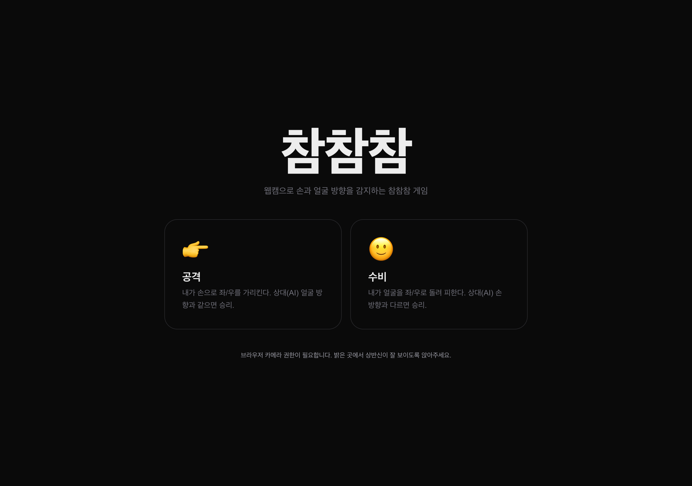
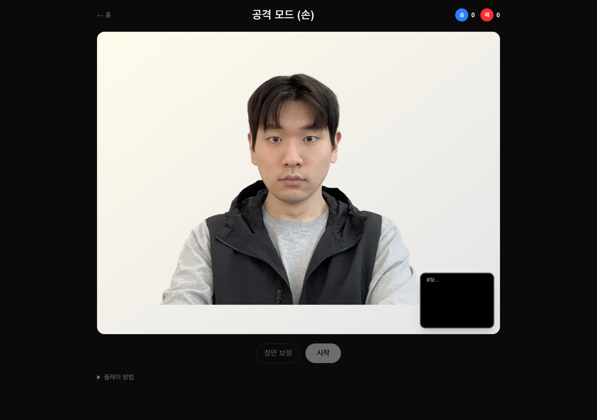
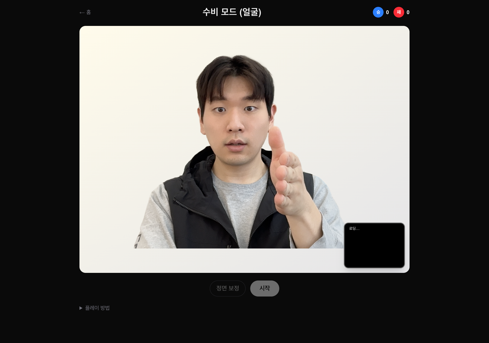

# chamchamcham

> 고개를 돌리느냐, 손날을 돌리느냐. 웹캠으로 즐기는 한국식 참참참.
> A vibe-coded webcam mini-game by [TNT Games](https://tntgames.xyz).

`chamchamcham`은 웹캠으로 얼굴과 손을 인식해서
**“참! 참! 참!” 박자에 맞춰 좌/우 방향을 겨루는 브라우저 게임**입니다.

설치 없이 바로 켜서, 카메라만 허용하면 곧바로 플레이할 수 있게 만드는 게 이 프로젝트의 핵심입니다.
어릴 때 친구랑 손가락으로 했던 그 참참참을, AI를 상대로 해보면 어떨까 싶어서 끝까지 밀어붙인 바이브 코딩 프로젝트입니다.

---

## Play

- **Live**: https://tntgames.xyz
- **Studio**: TNT Games
- **Repository**: https://github.com/Gojaehyeon/chamchamcham

> 브라우저에서 카메라 권한 허용이 필요합니다.

---

## Screenshots

### Home — mode select



### Attack mode — AI defender



### Defense mode — AI attacker



> README 이미지는 Puppeteer로 캡처했습니다.
> `npm run screenshots:readme`

---

## What it is

이 게임은 격투 게임이라기보다는
**웹캠 제스처 인식 + 한국식 손놀이 + 약간의 장난기**에 가깝습니다.

규칙은 간단합니다:

1. **공격 모드** — 당신은 손날, AI는 얼굴.
   "참! 참! 참!" 마지막 박자에 AI가 고개를 돌립니다.
   당신의 손날이 **AI 얼굴 방향과 같으면 승리**.
2. **수비 모드** — 당신은 얼굴, AI는 손날.
   AI가 손날을 휘두르는 그 순간에 당신은 고개를 돌립니다.
   당신의 얼굴이 **AI 손날 방향과 다르면 승리**.

---

## Features

- **웹캠 기반 얼굴/손 인식**
  - MediaPipe FaceLandmarker / HandLandmarker 사용
  - 코·광대 좌표로 yaw 계산
  - 손목·손가락 관절로 손날 포즈 판정

- **참참참 코어 루프**
  - "참! 참! 참!" 3비트 카운트다운
  - 마지막 박자에서만 AI 머리/손이 돌아감
  - 판정 후 리빌 딜레이를 두어 AI의 자세를 사람이 볼 수 있게

- **이미지 애니메이션**
  - idle / win / lose 상태마다 2프라임 교차
  - 380ms 인터벌 드로잉으로 도트 애니메이션 같은 느낌

- **한국어 TTS**
  - Web Speech API 기반 "참 참 참!" 보이스
  - 가능하면 남성 한국어 보이스 우선 선택
  - 없는 환경에서는 pitch 보정으로 톤 다운

- **점수판**
  - 파란 동그라미 "승" / 빨간 동그라미 "패" 뱃지
  - 라운드 결과에 따라 즉시 누적

- **두 가지 모드 전환**
  - 공격 / 수비 모드를 홈에서 바로 선택
  - 같은 인식 파이프라인을 양쪽에서 재사용

---

## Controls

### Desktop

- **공격 모드**: "참 참 참!" 마지막 박자에서 손날을 좌/우로 휘두르기
- **수비 모드**: "참 참 참!" 마지막 박자에서 고개를 좌/우로 돌리기
- **PIP**: 우하단 미니 캠으로 인식 상태 실시간 확인

### Mobile

- 세로 모드 플레이 대응
- 브라우저 / 기기 환경에 따라 카메라 권한 허용 필요

---

## Tech stack

- **Next.js 16** (App Router, Turbopack)
- **React 19**
- **TypeScript**
- **Tailwind CSS v4**
- **MediaPipe Tasks Vision**
  - FaceLandmarker
  - HandLandmarker
- **Web Speech API** (TTS)
- **Web Audio API** (beep)
- **Puppeteer** (README 스크린샷 캡처)

---

## Run locally

```bash
npm install
npm run dev
```

브라우저에서 `http://localhost:3000`을 열고:

1. 카메라 권한 허용
2. 공격 / 수비 모드 선택
3. "시작" 누르고 카메라 캘리브레이션
4. "참! 참! 참!" 박자에 맞춰 플레이

### Production build

```bash
npm run build
npm start
```

### README 스크린샷 다시 찍기

```bash
npm run dev      # 다른 터미널에서
npm run screenshots:readme
```

기본 타깃은 `http://127.0.0.1:3030`입니다. 다른 포트면 `README_SCREENSHOT_URL=http://localhost:3000 npm run screenshots:readme`.

---

## Notes

- 이 게임은 **카메라 권한이 없으면 동작하지 않습니다**
- 일부 인앱 브라우저에서는 카메라 접근이 제한될 수 있습니다
- 가장 안정적인 환경은 최신 Chrome / Safari / Edge 계열 브라우저입니다
- 처음 한 번은 MediaPipe 모델을 받느라 약간 로딩이 있을 수 있습니다

---

## Project structure

```text
src/
├── app/              # Next.js App Router (home, /attack, /defense)
├── components/       # GameStage, WebcamCanvas
├── hooks/            # useDetector
└── lib/              # mediapipe, direction, audio, types

public/
└── images/           # AI 캐릭터 포즈 / 결과 이미지

scripts/
└── capture-readme-screenshots.mjs

assets/
└── images/           # README 스크린샷
```

---

## Why I made this

그냥 재밌어 보여서 만들었습니다.

정확히는:

- 어릴 때 손가락 두 개로 했던 참참참을
- 카메라 앞에서 진짜 고개를 돌리면서 하면
- AI 캐릭터가 마지막 박자에 휙 고개를 돌리는 순간이
- 생각보다 훨씬 멍청하고 재밌습니다

이 프로젝트는
**쓸모보다 재미, 완성도보다 추진력, 설명 가능성보다 "일단 해보자"** 쪽에 더 가까운 작업입니다.

그래서 더 좋습니다.

---

## License

MIT
